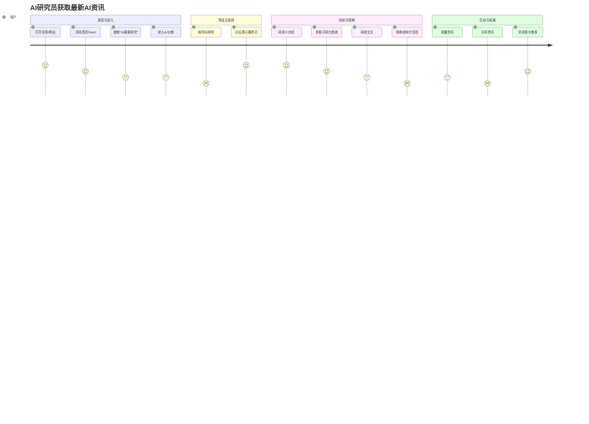
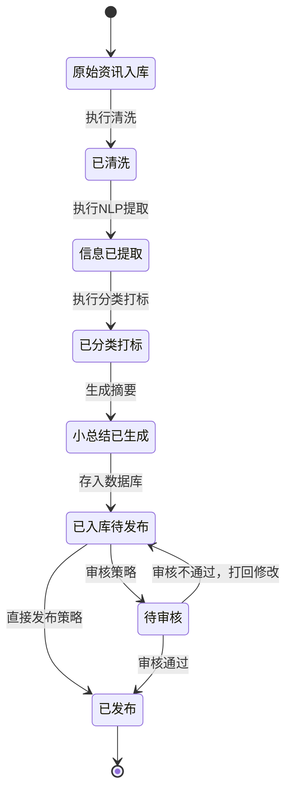

# 产品需求文档（PRD）

## 1. 文档信息

### 1.1 版本历史
- 初始版本

### 1.2 文档目的
- 本文档旨在详细描述全球最新科技资讯产品的功能和市场定位。

### 1.3 相关文档引用
- 无

## 2. 产品概述

### 2.1 产品名称与定位
- 产品名称：全球最新科技资讯
- 产品定位：提供全球最新的科技资讯，涵盖大型科技公司、大学、论文发表等。

### 2.2 产品为顾客解决的痛点
- 提供可靠的科技资讯来源，帮助用户快速获取最新信息。

### 2.3 产品的市场份额
- **初步预估**：全球科技资讯市场用户基数庞大，预计可触达数百万至千万级对最新科技动态高度关注的用户。
- **调研方向**：
    - 分析现有科技媒体、资讯聚合平台的用户规模和增长趋势。
    -调研目标用户群体（科技从业者、研究人员、投资者、爱好者）在获取科技资讯上的花费和时间投入。
    - 评估不同区域市场（北美、欧洲、亚洲）的潜力。

### 2.4 目标平台列表
- iOS
- Android
- Web

### 2.5 产品独特卖点
- 结构化和可视化的资讯呈现
- 资讯小总结功能
- 以各种图表进行资讯可视化呈现

### 2.6 商业模式概述
- **初步设想**：
    - **免费增值模式**：基础资讯免费，高级功能（如深度分析报告、定制化资讯推送、去广告）收费。
    - **广告模式**：在免费内容中植入精准投放的科技类广告。
    - **订阅模式**：提供不同层级的订阅服务，满足不同用户需求。
    - **B端服务**：为企业或机构提供定制化的科技资讯情报服务。

## 3.1 目标用户画像（详细）

### 3.1.1 人口统计特征
- 科技爱好者
- 学术研究人员

### 3.1.2 行为习惯与偏好
- 经常浏览科技资讯网站

### 3.1.3 用户核心需求与痛点
- 快速获取可靠的科技资讯

### 3.1.4 用户动机与目标
- 了解最新科技动态

## 3.2 用户场景分析

### 3.2.1 核心使用场景
- 用户在通勤途中查看最新科技资讯

### 3.2.2 边缘场景的可能性
- 用户在会议中快速查找相关科技信息

## 3.3.1 吸引用户的来源
- 社交媒体平台（如TikTok, YouTube, IG, Facebook）

## 4. 市场与竞品分析

### 4.1 市场规模与增长预测
- **调研方向**：
    - 收集全球数字信息服务市场、在线内容消费市场的规模数据。
    - 分析科技资讯细分领域的增长率和未来预测报告。
    - 关注AI在内容生成与聚合领域对市场格局的潜在影响。

### 4.2 行业趋势分析
- **调研方向**：
    - **个性化与精准化**：用户对内容的相关性和个性化推荐要求越来越高。
    - **内容可信度**：在信息爆炸时代，对可靠、经过验证的资讯来源需求迫切。
    - **多媒体与可视化**：图文、音视频、交互式图表等多样化内容形式更受欢迎。
    - **AI驱动的内容处理**：AI在资讯聚合、摘要生成、趋势分析等方面的应用日益广泛。
    - **社群化与互动性**：用户倾向于在社群中讨论和分享资讯。

### 4.3 竞争格局分析

#### 4.3.1 直接竞争对手详细分析
- **调研方向**：
    - **识别主要竞品**：如TechCrunch, Wired, The Verge, 36氪, InfoQ等国内外知名科技媒体和资讯平台。
    - **分析维度**：
        - **产品定位与目标用户**
        - **核心功能与特色**
        - **内容来源与质量控制**
        - **盈利模式**
        - **用户体验（UI/UX）**
        - **市场份额与用户口碑**
        - **技术架构（如适用）**

#### 4.3.2 间接竞争对手详细分析
- **调研方向**：
    - **识别间接竞品**：如RSS阅读器（Feedly）、内容聚合平台（Flipboard）、专业领域数据库（IEEE Xplore, ACM Digital Library）、社交媒体上的科技KOL等。
    - **分析维度**：它们如何满足用户获取科技资讯的部分需求，以及本产品如何提供差异化价值。

### 4.4 竞品功能对比矩阵
- **后续行动**：根据直接竞争对手的分析结果，制作详细的功能对比矩阵，突出本产品的核心优势。

### 4.5 产品差异化策略
- **核心思路**：
    - **资讯来源的权威性与全面性**：严格筛选大型科技公司、顶尖大学、核心期刊等一手信息源。
    - **高效的结构化与可视化呈现**：通过标签、分类、时间线、关系图谱等方式，帮助用户快速理解复杂信息。
    - **智能小总结**：利用AI技术生成精炼准确的资讯摘要，节省用户阅读时间。
    - **深度定制化**：允许用户根据兴趣领域、关注机构等维度定制个性化的资讯流。

## 5. 产品功能需求

### 5.1 功能架构与模块划分
- **核心模块**：
    - 资讯收集模块
    - 内容处理与结构化模块
    - 可视化呈现模块
    - 资讯小总结模块
    - 用户个性化推荐模块 (V2.0)
    - 用户账户与设置模块
- **支撑模块**：
    - 数据存储模块
    - API接口模块
    - 后台管理模块

### 5.2 核心功能详述

#### 5.2.1 资讯收集模块
- **功能描述**：作为用户，我希望能自动从全球顶级的科技公司官网、知名大学研究机构、权威学术论文库以及行业领袖的官方发布渠道，获取最新、最可靠的科技资讯和研究成果。
- **用户价值**：确保资讯的权威性、及时性和全面性，避免信息过载和虚假信息干扰。
- **功能逻辑与规则**：
    - **资讯源管理**：后台可配置和管理资讯来源列表，确保来源的质量和覆盖面（例如：大型科技公司如Google AI Blog, Microsoft Research, Apple Newsroom；大学如MIT News, Stanford Engineering；论文库如arXiv, Nature, Science；行业会议如NeurIPS, ICML）。
    - **定时爬取与API接入**：系统定时通过爬虫或API接口从指定来源获取最新发布的资讯。
    - **内容去重与初步筛选**：对收集到的资讯进行初步的去重和相关性筛选。
- **交互要求**：后台管理界面应支持方便地添加、编辑、删除和监控资讯源状态。
- **数据要求**：支持HTML、RSS、API (JSON/XML)等多种数据源格式的接入和解析。
- **技术依赖**：
    - 网络爬虫技术（如Scrapy, BeautifulSoup）。
    - API接口对接能力。
    - 任务调度系统（如Celery, APScheduler）。

#### 5.2.2 内容处理与结构化模块
- **功能描述**：作为用户，我希望收集到的原始资讯能够被系统自动处理，提取关键信息，并以统一的、结构化的方式组织起来，方便我理解和检索。
- **用户价值**：提高信息获取效率，快速定位关键内容，便于跨资讯的比较和分析。
- **功能逻辑与规则**：
    - **关键信息提取**：利用NLP技术提取资讯的标题、作者、发布日期、来源机构、关键词、核心观点等。
    - **内容分类与打标**：根据预设的科技领域分类体系（如人工智能、生物科技、量子计算、航空航天等）和关键词标签，对资讯进行自动分类和打标。
    - **实体识别与链接**：识别资讯中提及的公司、人物、技术、产品等实体，并建立关联链接。
    - **多语言处理**：支持对不同语种资讯的处理，并提供翻译选项（可选）。
- **交互要求**：用户在浏览资讯时，可以清晰地看到这些结构化信息，并能通过分类和标签进行筛选。
- **数据要求**：结构化数据需存储于数据库，支持高效查询和索引。
- **技术依赖**：
    - 自然语言处理（NLP）库（如spaCy, NLTK, Stanford CoreNLP）。
    - 文本分类、关键词提取、实体识别算法。
    - 机器翻译API（如Google Translate API）。

#### 5.2.3 可视化呈现模块
- **功能描述**：作为用户，我希望产品能将复杂的科技资讯和数据，通过直观的图表、时间线或关系图谱等可视化方式展现，帮助我更好地理解趋势和关联。
- **用户价值**：降低认知负荷，快速洞察资讯背后的模式、趋势和联系，提升阅读体验。
- **功能逻辑与规则**：
    - **趋势图表**：针对特定技术领域或关键词，展示其在一段时间内的资讯热度、提及频率等趋势图。
    - **时间线视图**：将相关联的事件或某项技术的发展历程，在时间轴上清晰展示。
    - **关系图谱**：展示不同科技公司、研究机构、技术概念之间的关联网络。
    - **数据驱动可视化**：根据资讯中包含的结构化数据（如市场份额、性能指标）自动生成合适的图表（如饼图、柱状图）。
- **交互要求**：可视化图表应具有良好的交互性，支持用户进行筛选、缩放、高亮等操作。界面美观，信息层级清晰。
- **数据要求**：依赖于结构化处理后的数据。
- **技术依赖**：
    - 前端可视化库（如D3.js, ECharts, Chart.js）。
    - 图数据库（如Neo4j，可选，用于复杂关系图谱）。

#### 5.2.4 资讯小总结模块
- **功能描述**：作为用户，我希望能快速浏览每条资讯的核心内容，因此需要系统为每条资讯自动生成一段简明扼要的小总结。
- **用户价值**：极大节省阅读时间，帮助用户快速判断资讯是否值得深入阅读。
- **功能逻辑与规则**：
    - **自动摘要生成**：利用NLP的文本摘要算法（抽取式或生成式），为每条资讯生成100-300字左右的摘要。
    - **摘要质量控制**：摘要需准确反映原文核心观点，语句通顺，无明显逻辑错误。
    - **多篇幅选项**（可选）：允许用户选择不同长度的摘要（如一句话摘要、段落摘要）。
- **交互要求**：小总结应在资讯列表页或详情页的显著位置展示。
- **数据要求**：原始资讯文本。
- **技术依赖**：
    - 文本摘要算法与模型（如TextRank, BERT-based models, GPT系列API）。

### 5.3 次要功能描述
- 待定

### 5.4 未来功能储备
- 待定

## 6. 用户流程与交互设计指导

### 6.1 核心用户旅程地图
- **示例用户旅程（获取并阅读一篇AI领域最新资讯）**：
    1. **发现需求**：用户（如AI研究员）希望了解AI领域的最新进展。
    2. **打开应用/网站**：用户启动“全球最新科技资讯”应用或访问网站。
    3. **浏览/搜索**：
        - 用户在首页Feed流中浏览推荐的最新资讯。
        - 或用户使用搜索功能，输入关键词“人工智能最新研究”。
        - 或用户通过分类导航进入“人工智能”版块。
    4. **筛选与排序**（可选）：用户按发布时间、热度或来源机构进行排序或筛选。
    5. **选择资讯**：用户被一篇标题吸引，点击进入详情页。
    6. **快速理解**：用户首先阅读顶部的“资讯小总结”，快速把握核心内容。
    7. **查看可视化**（如适用）：用户注意到资讯中包含一个关于“AI模型性能对比”的可视化图表，点击查看详情并进行交互探索。
    8. **深入阅读**：用户对内容感兴趣，继续阅读完整资讯。
    9. **查看结构化信息**：用户关注资讯的来源、作者、相关标签等结构化信息。
    10. **互动操作**（可选）：用户收藏该资讯，或分享到社交媒体。
    11. **发现更多**：用户通过资讯底部的相关推荐，发现更多感兴趣的内容。
- **Mermaid图描述**：

### 6.2 关键流程详细描述与状态转换图
- **关键流程：资讯处理与发布流程**
    1. **获取原始资讯**：系统从配置的资讯源（API、爬虫）获取到新的原始资讯数据。
        - 状态：原始资讯入库
    2. **内容清洗与格式化**：去除HTML标签、广告、无关脚本，统一文本格式。
        - 状态：已清洗
    3. **关键信息提取**：NLP模块提取标题、作者、发布时间、来源、关键词等。
        - 状态：信息已提取
    4. **内容分类与打标**：自动分配到预设的科技分类，并打上相关标签。
        - 状态：已分类打标
    5. **生成小总结**：调用摘要算法生成资讯小总结。
        - 状态：小总结已生成
    6. **数据结构化存储**：将处理后的资讯及元数据存入数据库。
        - 状态：已入库（待审核/待发布）
    7. **人工审核**（可选，根据策略配置）：运营人员对AI处理结果进行抽查或全部审核，确保质量。
        - 状态：审核通过 / 审核不通过（打回）
    8. **发布上线**：资讯在前端对用户可见。
        - 状态：已发布
- **Mermaid图描述 (状态转换)**：

### 6.3 对设计师（UI/UX Agent）的界面原型参考说明和要求
- **首页/Feed流**：
    - **信息密度与可读性平衡**：卡片式设计，每条资讯清晰展示标题、来源、发布时间、小总结（部分）、缩略图（如有）。
    - **突出可视化元素**：如果资讯包含可视化图表，应有明显标识。
    - **高效筛选与排序**：提供便捷的分类切换、排序选项（最新、最热等）。
- **资讯详情页**：
    - **阅读体验优先**：正文排版清晰，字体大小、行间距适宜长时间阅读。
    - **小总结置顶**：方便用户快速了解核心内容。
    - **结构化信息展示**：来源、作者、标签、分类等信息清晰可见，但不干扰正文阅读。
    - **可视化模块**：嵌入式或可展开的可视化图表，交互友好。
    - **相关推荐**：智能推荐相关资讯，引导用户深度阅读。
- **搜索功能**：
    - **关键词联想与历史记录**。
    - **高级搜索选项**：支持按来源、时间范围、标签等进行精确搜索。
- **整体风格**：
    - **科技感与专业性**：界面设计体现科技产品的现代感和资讯的专业性。
    - **简洁易用**：避免不必要的装饰，操作流程直观。

### 6.4 交互设计规范与原则建议
- **一致性**：遵循平台设计规范（iOS Human Interface Guidelines, Android Material Design），应用内控件和交互模式保持一致。
- **反馈及时**：用户的操作应有及时明确的反馈（如加载状态、操作成功/失败提示）。
- **容错性**：允许用户撤销操作，提供清晰的错误提示和引导。
- **易学性**：核心功能易于上手，新用户无需过多学习即可使用。
- **效率**：减少用户操作步骤，优化高频操作路径。
- **可访问性**：考虑不同用户群体的需求，支持辅助功能（如字体大小调整、屏幕阅读器适配）。

## 7. 非功能需求

### 7.1 性能需求
- **响应时间**：
    - 首页Feed流加载：首次加载 < 3秒，后续加载 < 1秒。
    - 资讯详情页加载：< 2秒。
    - 搜索结果响应：< 1.5秒。
    - 可视化图表渲染：< 2秒。
- **稳定性**：应用崩溃率 < 0.1% (DAU)。
- **资源使用率**：
    - 移动端：平均CPU占用率 < 15%，内存占用合理。
    - Web端：页面资源大小优化，减少白屏时间。
- **并发量**：初期支持1000 QPS，具备水平扩展能力。

### 7.2 安全需求
- **数据加密**：
    - 用户敏感信息（如密码）在传输和存储过程中必须加密。
    - API接口通信使用HTTPS。
- **认证授权**：
    - 用户账户采用安全的认证机制（如OAuth 2.0）。
    - 后台管理系统需有严格的权限控制。
- **隐私保护**：
    - 遵守相关国家和地区的隐私法规（如GDPR, CCPA）。
    - 清晰告知用户数据收集和使用方式，提供隐私设置选项。
- **防攻击策略**：
    - 防范常见的Web攻击（如XSS, CSRF, SQL注入）。
    - API接口进行限流和防刷。

## 8. 技术架构考量

### 8.1 技术栈建议
- **前端**：
    - **Web**：React / Vue.js / Angular 等现代前端框架。
    - **iOS**：Swift / Objective-C。
    - **Android**：Kotlin / Java。
    - **可视化**：D3.js, ECharts, AntV G2/G6。
- **后端**：
    - **主力语言**：Python (Django/Flask) / Node.js (Express) / Java (Spring Boot) / Go。
    - **NLP处理**：Python (spaCy, NLTK, Transformers库)。
    - **数据库**：
        - **关系型**：PostgreSQL / MySQL (存储结构化资讯、用户信息)。
        - **NoSQL**（可选）：MongoDB (存储非结构化或半结构化数据), Elasticsearch (用于搜索)。
        - **图数据库**（可选）：Neo4j (用于知识图谱和关系可视化)。
    - **消息队列**：Kafka / RabbitMQ (用于任务异步处理)。
    - **缓存**：Redis / Memcached。
- **AI/ML**：
    - **文本摘要**：预训练模型（BERT, GPT系列）API 或自研模型。
    - **推荐系统**：协同过滤、基于内容的推荐算法，或使用云服务商的推荐引擎。
- **部署与运维**：
    - **容器化**：Docker, Kubernetes。
    - **云平台**：AWS / Azure / Google Cloud / 阿里云等。
    - **CI/CD**：Jenkins, GitLab CI, GitHub Actions。

### 8.2 系统集成需求
- **第三方登录**：支持主流社交平台账号登录（如Google, Facebook, Apple ID, 微信）。
- **支付集成**（如涉及付费功能）：集成Stripe, PayPal等支付网关。
- **分析统计服务**：集成Google Analytics, Mixpanel, Amplitude等用户行为分析工具。
- **推送服务**：集成Firebase Cloud Messaging (FCM), Apple Push Notification service (APNs)等消息推送服务。

### 8.3 技术依赖与约束
- **外部API依赖**：
    - 资讯源API的稳定性、调用频率限制、费用。
    - 机器翻译API、文本摘要API的可用性和成本。
- **NLP模型性能**：分类、摘要、实体识别等模型的准确率和处理效率。
- **数据合规性**：确保爬取和使用数据的行为符合相关法律法规和资讯源的服务条款。
- **可扩展性**：系统架构需支持未来的用户量和数据量增长。

### 8.4 数据模型建议
- **核心实体**：
    - **User (用户)**：user_id (PK), username, password_hash, email, registration_date, last_login, preferences (JSON), subscription_status。
    - **Article (资讯)**：article_id (PK), title, original_url, source_id (FK to Source), publication_date, raw_content, processed_content, summary, ai_summary, language, status (e.g., pending, published, archived), created_at, updated_at。
    - **Source (资讯源)**：source_id (PK), name, base_url, type (e.g., company_blog, university_research, journal), fetch_frequency, last_fetched_at。
    - **Category (分类)**：category_id (PK), name, description, parent_category_id (FK to self)。
    - **Tag (标签)**：tag_id (PK), name。
    - **ArticleCategory (资讯分类关联表)**：article_id (FK), category_id (FK)。
    - **ArticleTag (资讯标签关联表)**：article_id (FK), tag_id (FK)。
    - **Visualization (可视化数据)**：viz_id (PK), article_id (FK), type (e.g., timeline, graph, chart), data_json, config_json。
    - **UserSavedArticle (用户收藏)**：user_id (FK), article_id (FK), saved_at。
    - **UserFeedback (用户反馈，如摘要评分)**：feedback_id (PK), user_id (FK), article_id (FK), feedback_type, score, comment, created_at。

## 9. 验收标准汇总

### 9.1 功能验收标准矩阵
| 功能模块         | 功能点                                 | 验收标准                                                                                                | 优先级 | 备注                                   |
|------------------|----------------------------------------|-------------------------------------------------------------------------------------------------------|--------|----------------------------------------|
| 资讯收集模块     | 添加新的资讯源                         | 后台能成功添加、编辑、启用/禁用资讯源，并按设定频率抓取                                                               | P0     | 支持RSS, API, 网页爬取等多种方式         |
|                  | 资讯自动更新                           | 系统能自动从已配置的资讯源获取最新内容，并进行去重                                                                    | P0     |                                        |
| 内容处理与结构化 | 关键信息提取（标题、作者、时间、来源） | 提取准确率 > 95%                                                                                        | P0     |                                        |
|                  | 自动分类与打标                         | 分类准确率 > 90%，标签能覆盖主要内容点                                                                      | P0     |                                        |
|                  | 实体识别                               | 能正确识别资讯中的主要公司、人物、技术等实体                                                                      | P1     |                                        |
| 可视化呈现模块   | 趋势图表展示                           | 能根据关键词或领域展示资讯热度趋势，图表交互流畅                                                                    | P1     |                                        |
|                  | 时间线视图                             | 能清晰展示特定事件或技术发展的时间脉络                                                                        | P1     |                                        |
|                  | 关系图谱（基础）                       | 能展示资讯中实体间的简单关联                                                                                | P2     | MVP可简化或不做                        |
| 资讯小总结模块   | AI自动生成摘要                         | 摘要长度符合设定（100-300字），核心观点覆盖率 > 80%，语句通顺可读                                                      | P0     |                                        |
| 用户界面与交互   | 资讯Feed流展示                         | 卡片式布局，信息清晰，加载流畅                                                                                | P0     |                                        |
|                  | 资讯详情页                             | 阅读体验良好，小总结、结构化信息、可视化模块展示清晰                                                                  | P0     |                                        |
|                  | 搜索功能                               | 支持关键词搜索，结果准确，响应快速                                                                            | P0     |                                        |
| 用户个性化推荐   | 基于用户行为的推荐                     | （V2.0）能根据用户浏览历史、收藏等行为推荐相关资讯                                                                  | P1     | V2.0功能                               |
| 用户账户         | 注册登录                               | 支持邮箱/手机号注册，第三方登录，密码安全存储                                                                     | P0     |                                        |
|                  | 用户偏好设置                           | 用户可设置感兴趣的领域、屏蔽不感兴趣的内容                                                                        | P1     |                                        |

### 9.2 性能验收标准
- **响应时间**：
    - 核心页面（首页、详情页）平均加载时间 < 2秒。
    - API接口平均响应时间 < 500ms (P95 < 1s)。
- **并发处理**：系统在1000并发用户下，核心功能稳定运行，错误率 < 0.5%。
- **数据处理能力**：每日新增10万条资讯的处理和入库时间 < 2小时。

### 9.3 质量验收标准
- **Bug密度**：严重Bug < 0.1个/KLOC，主要Bug < 0.5个/KLOC。
- **代码覆盖率**：单元测试覆盖率 > 70%，核心模块 > 85%。
- **UI规范符合度**：95%以上的界面元素符合设计规范。
- **数据准确性**：资讯内容、来源、时间等关键信息准确率 > 99%。
- **安全性**：通过主流安全扫描工具检测，无高危漏洞。

## 10. 产品功能指标

### 10.1 关键绩效指标（KPIs）定义与目标
- **用户增长与活跃度**：
    - **日活跃用户数 (DAU)**：目标 MVP后3个月达到 1万。
    - **月活跃用户数 (MAU)**：目标 MVP后3个月达到 5万。
    - **用户平均使用时长**：目标 > 15分钟/日。
    - **次日留存率**：目标 > 40%。
    - **7日留存率**：目标 > 20%。
- **内容消费**：
    - **人均资讯阅读量**：目标 > 10篇/日/活跃用户。
    - **小总结阅读率**（阅读小总结的用户数 / 查看该资讯的用户数）：目标 > 70%。
    - **可视化模块交互率**：目标 > 30% (针对包含可视化的资讯)。
- **内容质量与覆盖**：
    - **资讯源数量与质量**：覆盖主流科技领域，权威资讯源占比 > 80%。
    - **资讯更新频率**：核心资讯源延迟 < 1小时。
- **商业化指标**（如适用）：
    - **付费用户转化率**。
    - **广告点击率 (CTR)**。

### 10.2 北极星指标定义与选择依据
- **北极星指标**：**有效阅读时长 (Engaged Reading Time)**
- **定义**：用户在产品内主动、有效阅读资讯内容的总时长。排除挂机、快速划过等无效时间。
- **选择依据**：
    - **反映用户价值**：用户投入时间阅读，说明产品提供的内容对他们有价值。
    - **驱动核心功能**：提升内容质量、优化推荐算法、改进阅读体验都能正向影响此指标。
    - **衡量产品健康度**：持续增长的有效阅读时长代表用户粘性和产品吸引力的提升。
    - **易于理解和衡量**：可以通过用户行为追踪进行统计。

### 10.3 指标数据监测计划
- **数据收集工具**：集成第三方用户行为分析平台（如Mixpanel, Amplitude）和自建数据仓库。
- **数据埋点方案**：详细规划用户关键行为的埋点，确保数据采集的准确性和全面性。
    - **页面浏览事件**：PV, UV。
    - **资讯阅读事件**：阅读开始、结束、时长、滚动深度、小总结阅读、可视化交互。
    - **用户互动事件**：收藏、分享、评论、搜索。
    - **用户账户事件**：注册、登录、订阅。
- **数据看板与报告**：
    - 建立核心指标的实时监控看板。
    - 定期生成产品数据报告（日报、周报、月报），分析趋势、发现问题、评估效果。
- **A/B测试平台**：用于验证新功能、优化策略对核心指标的影响。
- **报告频率**：
    - 核心运营指标：日报。
    - 用户行为分析：周报。
    - 产品迭代效果评估：按版本/功能上线周期。